# Tally

A store rating platform. One login for everyone; what you see depends on your role.

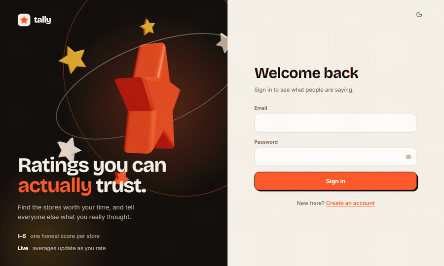

- **Customers** sign up, browse and search stores, and rate them 1–5. Rating again edits the earlier rating.
- **Store owners** see their store's average rating and who rated it.
- **Administrators** manage users and stores from a dashboard, with filters and sortable tables.

Built with Express 5, PostgreSQL 16 and React 19. Scope, architecture, data model and API contract are in [docs/BLUEPRINT.md](docs/BLUEPRINT.md).

## Screenshots

| | |
|---|---|
| 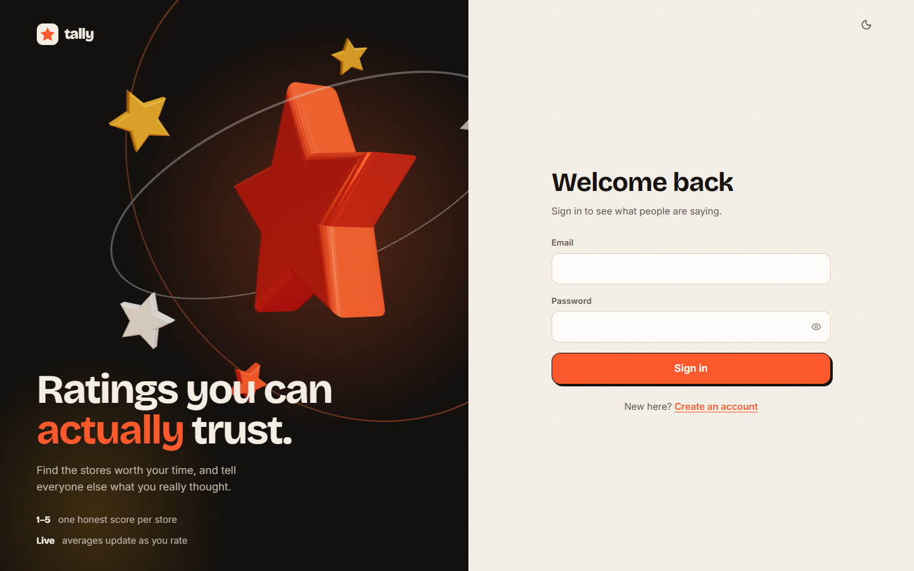 | 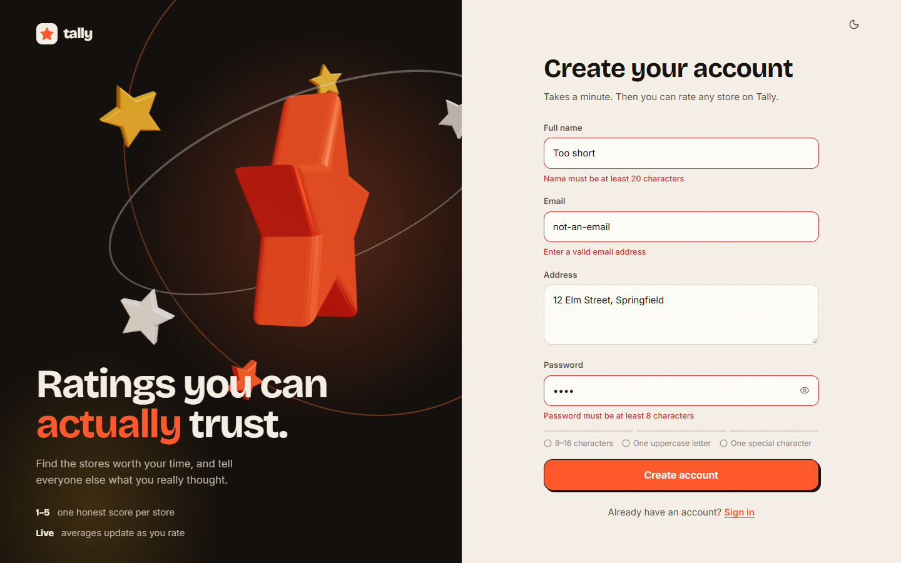 |
| **Sign in**: one login for all three roles | **Sign up**: rules checked as you type |
| 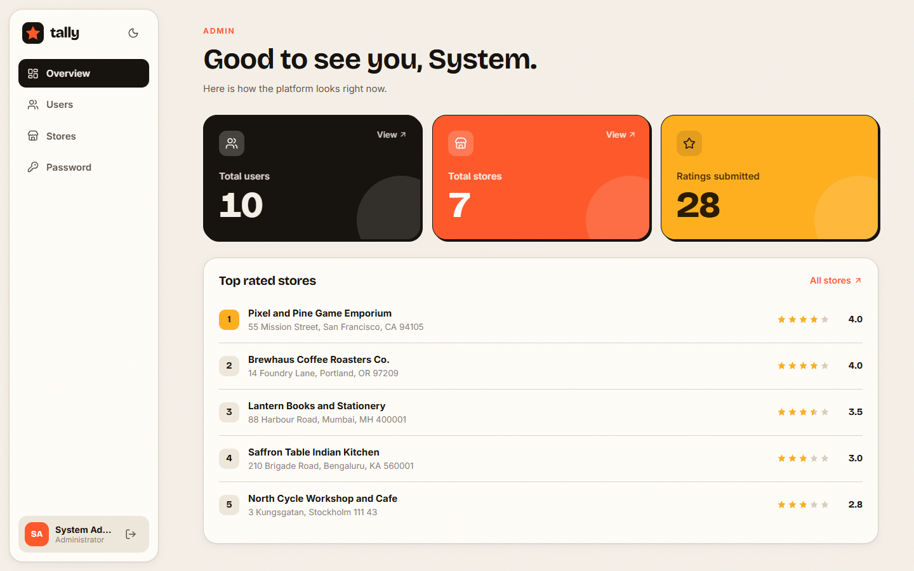 | 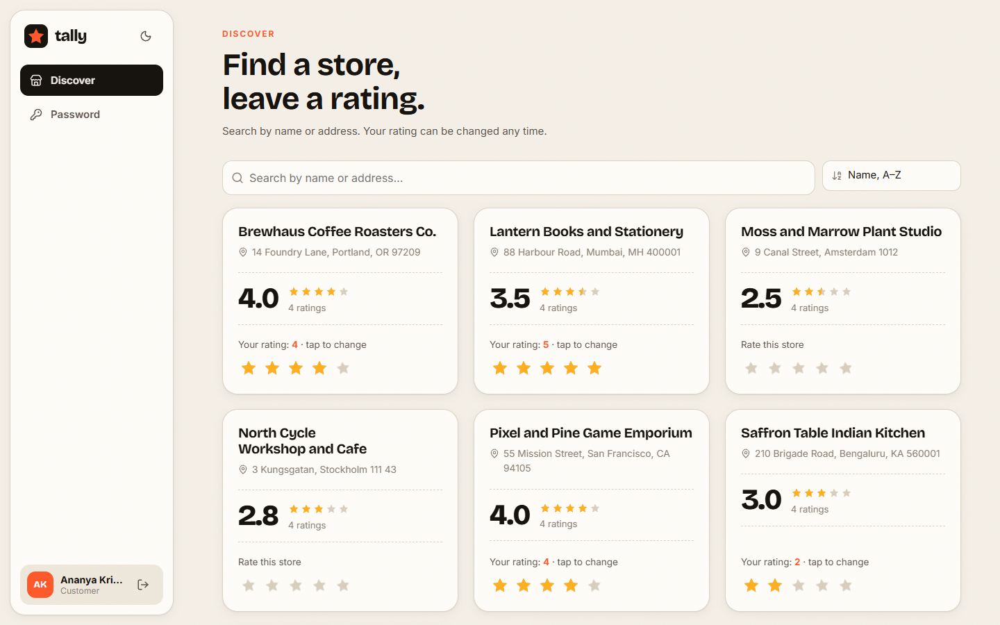 |
| **Admin overview**: totals and top-rated stores | **Customer**: search, overall rating, your rating |
| 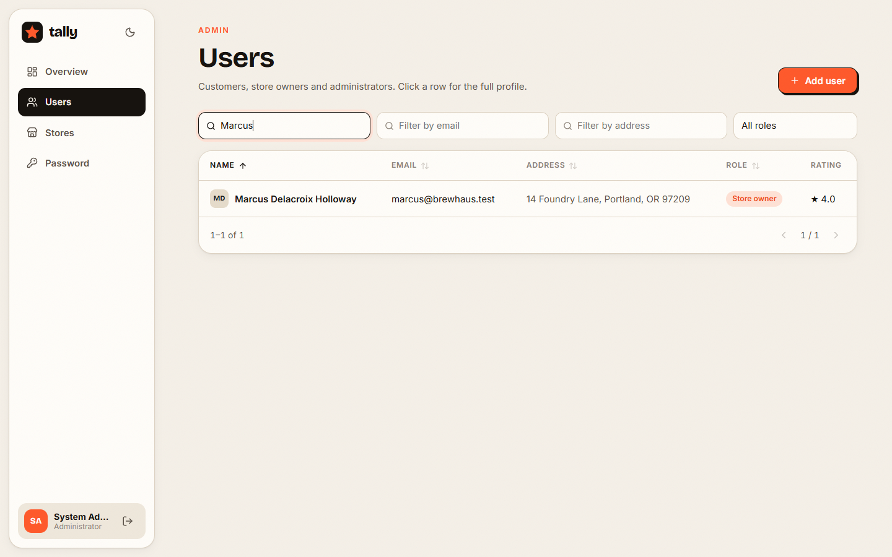 | 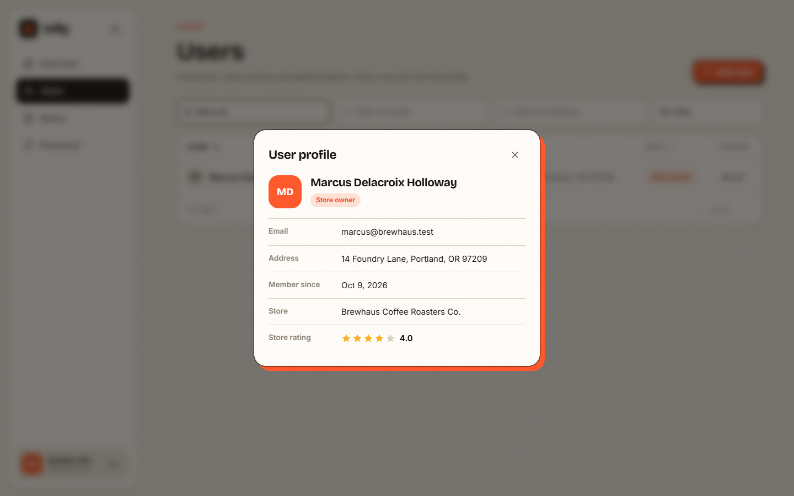 |
| **Admin users**: per-column filters, sortable headers | **User profile**: store owners show their rating |
| 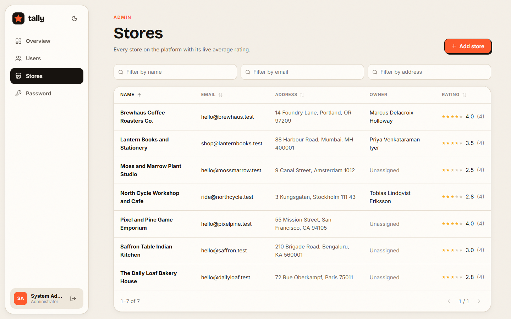 | 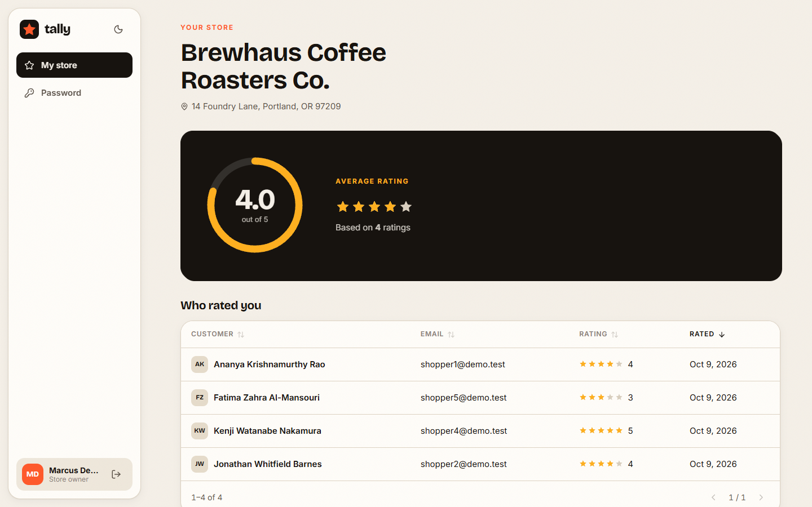 |
| **Admin stores**: sorted by rating | **Store owner**: average rating and raters |
| 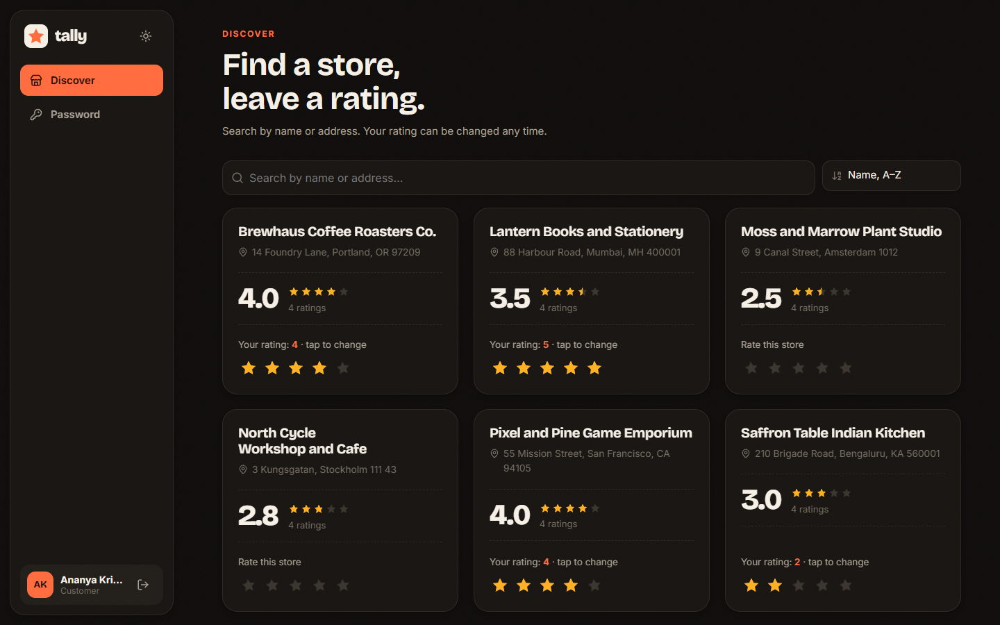 | 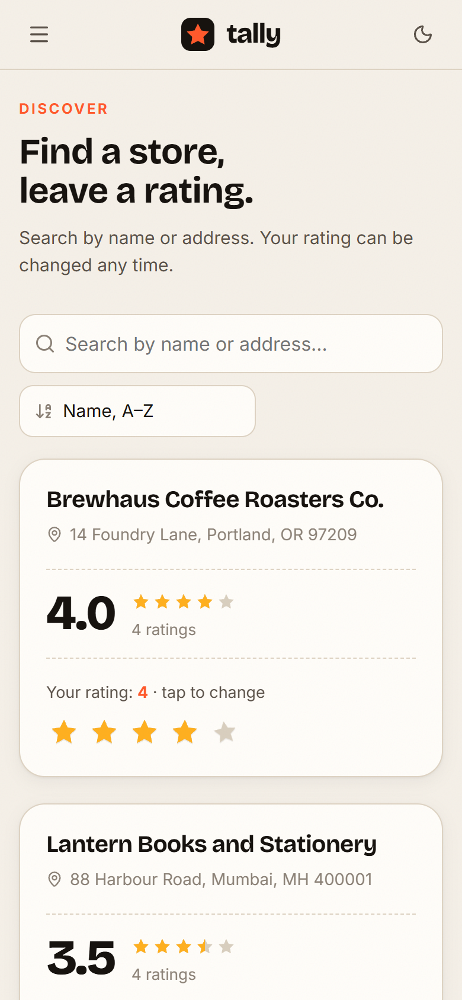 |
| **Dark theme** | **Responsive**: the same page on a phone |

## Run it locally

You need **Node 20+** and **Docker** (Docker Desktop is fine). Docker only runs PostgreSQL here; the API and the web app run directly on your machine so you get hot reload.

**1. Clone and configure**

```bash
git clone https://github.com/pranitap123/tally-store-ratings.git
cd tally-store-ratings
cp .env.example .env
```

The defaults in `.env.example` work for local development as they are. For anything shared, set `JWT_SECRET` to a random string of 32+ characters.

**2. Start the database**

```bash
docker compose up -d db
```

This creates the `tally` database, plus a `tally_test` database used by the API tests.

**3. Start the API** (terminal 1)

```bash
cd backend
npm install
npm run seed      # applies migrations and adds demo data
npm run dev       # http://localhost:4000
```

**4. Start the web app** (terminal 2)

```bash
cd frontend
npm install
npm run dev       # http://localhost:5173
```

Open <http://localhost:5173>. Vite proxies `/api` to the API, so the login cookie stays same-origin.

### Demo accounts

| Role | Email | Password |
|---|---|---|
| Administrator | `admin@tally.test` | `Admin@12345` |
| Store owner | `marcus@brewhaus.test` | `Passw0rd!demo` |
| Customer | `shopper1@demo.test` | `Passw0rd!demo` |

You can also create a customer account yourself on the sign-up page. For a clean database with only the admin account, run `npm run seed -- --admin-only`.

### Troubleshooting

- **Port 5432 is already in use**: another Postgres is running. Stop it, or change the host port in `docker-compose.yml` and the port in `DATABASE_URL`.
- **API exits with "Invalid environment configuration"**: `.env` is missing, or `JWT_SECRET` is shorter than 32 characters.
- **Login works but every page bounces back to sign in**: open the app on <http://localhost:5173>, not on port 4000, so the cookie is sent through the proxy.

## Run everything in Docker

```bash
cp .env.example .env          # set JWT_SECRET to 32+ random characters
docker compose --profile app up -d --build
docker compose --profile app run --rm api npm run seed
```

Open <http://localhost:8080>. nginx serves the built SPA and proxies `/api` to the API.

## Tests

```bash
cd backend  && npm test    # integration tests against a real Postgres (tally_test)
cd frontend && npm test    # validation rules and components
```

The API tests need the database from step 2. Set `TEST_DATABASE_URL` to use a different one. CI (`.github/workflows/ci.yml`) runs lint, tests and the build for both apps on every push.

## Project layout

```
backend/    Express API: modules/{auth,admin,stores,owner}, db/migrations, tests
frontend/   React SPA: components/ui, pages/{auth,admin,user,owner}, styles
docs/       Blueprint and README media
docker/     Postgres init script
```

## Validation rules

| Field | Rule |
|---|---|
| Name | 20–60 characters |
| Address | up to 400 characters |
| Password | 8–16 characters, at least one uppercase letter and one special character |
| Email | standard email format, unique (case-insensitive) |
| Rating | whole number 1–5 |

The API enforces these with zod, the forms mirror them for instant feedback, and the name and rating limits are also `CHECK` constraints in the database.

## Configuration

Everything comes from environment variables; see [.env.example](.env.example). The API refuses to start with a missing or short `JWT_SECRET`. Set `COOKIE_SECURE=true` when serving over HTTPS.
